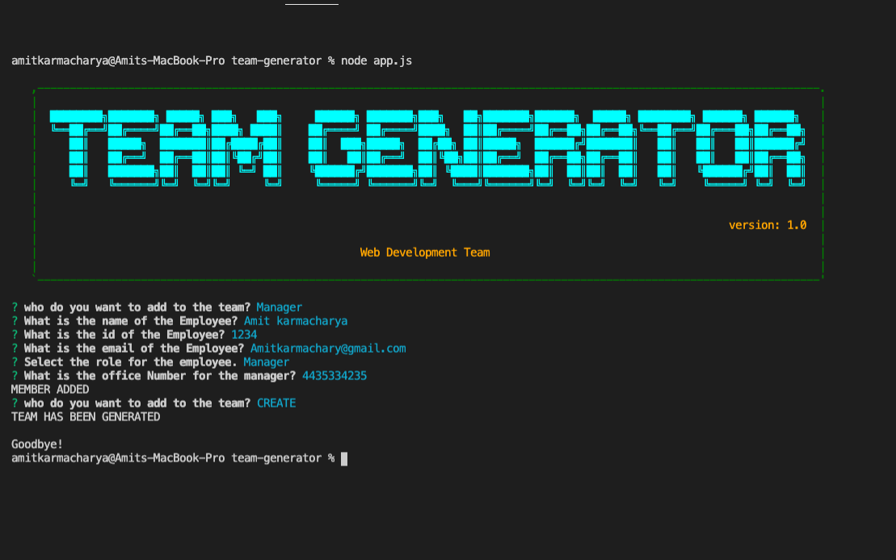
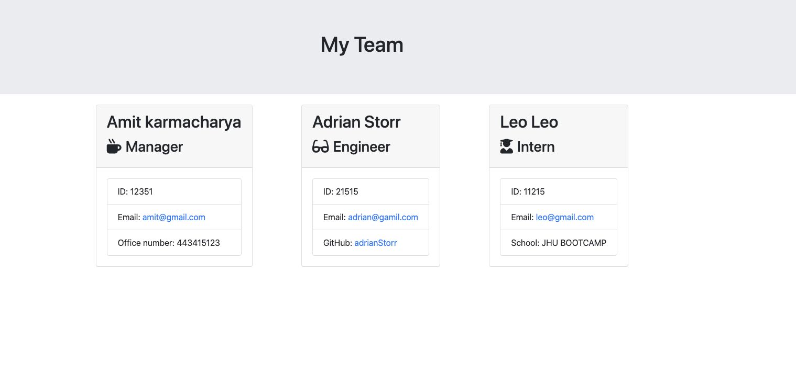

# Team Profile Generator

The application will prompt the user for information about the team manager and then information about the team members. The user can input any number of team members, and they may be a mix of engineers and interns. When the user has completed building the team, the application will create an HTML file that displays a nicely formatted team roster based on the information provided by the user.

[Watch Demo Video](https://youtu.be/tkEhlfNFYOY)

---
### Table of Contents
- [Installation](#installation)
- [Usage](#usage)
- [Author Info](#author-info)
- [License](#license)
---

##### TERMINAL snapshot

##### OUTPUT HTML snapshot

### Installation
- Install Node.js
- use the npm package manager to install the necessary package
  - run "npm install" in the terminal from projects root directory
  - To Run the app run 'node app.js'
  
### Usage
  use the app to create a web development team. You can add managers, Enginneer and interns. The output will create inside the output folder as team.html
  
  
### Author Info

  Amit karmacharya

  * Email - amitkarmacharya.work@gmail.com

  
### License

